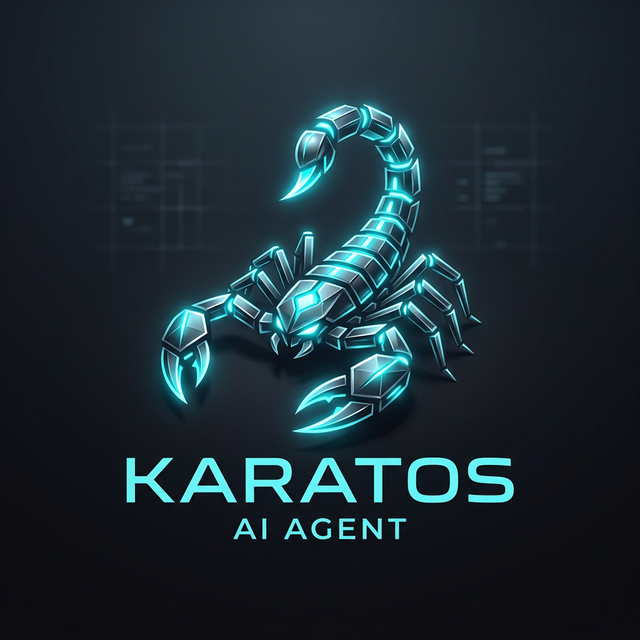

# 🦂 Karatos: Scaling Brain Architecture (V2.6)

  

> [!NOTE]
> This repository documentation reflects the **V2.6 "Scorpion" Upgrade**, a major breakthrough in agentic cognition and peer-to-peer scaling.

**Karatos** (formerly Little Niva) is a state-of-the-art autonomous system agent. With the V2.6 upgrade, Karatos has evolved from a reactive assistant into a highly scalable, communicative, and self-correcting cognitive entity.

## 🚀 The V2.6 "Scorpion" Overhaul

### 🧠 Dynamic Intent Escalation
Karatos now features **Neural Pivoting**. If a simple conversation (CHAT) intent is found to be insufficient for a complex request, the Brain automatically escalates to a **PLAN** intent. This self-correcting logic ensures the agent autonomously reaches for tools and data whenever a knowledge gap is detected during generation.

### 💬 Inter-Agent Messaging (Zero-Config)
We have decentralized Karatos' communication layer. Agents now coordinate via **Direct Messaging**. Each agent discovered in the group is exposed as a dynamic `agent:` tool, allowing the Brain to call other bots directly for collaborative planning and social interaction without any manual configuration.

### 🎞️ Episode-Aware Context & Critic
Interaction history is now segmented into discrete **Cognitive Episodes**, ensuring relevant memory retrieval without context pollution. Every generation cycle is preceded by a **Context Critic** audit, which critiques the sufficiency of available information and prevents vague or generic responses.

### 🛡️ Hardened Private Routing
Routing integrity has been reinforced with real-time Telegram metadata. Karatos now guarantees consistent responses in private 1-on-1 chats, ensuring the agent remains a reliable partner even in ambiguous interaction states.

---

## 🏛️ Cognitive Capabilities

- **Neural Identity Reconciliation**: Self-aware persona evolution based on persistent memory.
- **OTAR Cognitive Loop**: Continuous Observation, Thinking, Action, and Reflection.
- **Multimodal Perception**: High-fidelity Vision (Llama-Vision) and Audio (Whisper) analysis.
- **Secure Sovereignty**: AES-256 encrypted memory and strict ethical guardrails.

---

## License
Proprietary - NivaSound Internal Use Only
